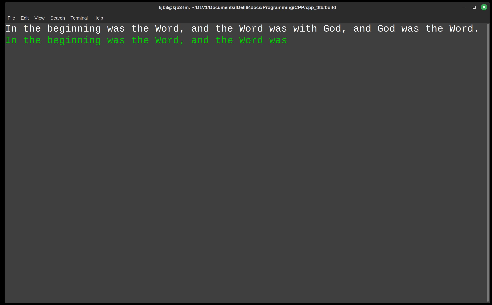

# Type Through the Bible (C++ Edition)
**A Typing Game of Biblical Proportions**

By Ken Burchfiel

Released under the MIT License

[Link to GitHub repository](https://github.com/kburchfiel/cpp_tttb)

[Link to game download page on Itch.io](https://kburchfiel.itch.io/tttb-cpp) (password: `microseconds`)

[Note: this Readme is still a work in progress, and many sections are still incomplete. More information will be provided soon!]

## Introduction

Type Through the Bible (TTTB) allows you to practice your keyboarding skills by typing the Bible verse by verse. It contains both single-player and multiplayer modes, and also offers (via a complementary Python script) a wide variety of interactive visualizations.

## Download instructions

Linux, Windows, and Apple-Silicon OSX binaries of TTTB are available [at this page](https://kburchfiel.itch.io/tttb-cpp) on itch.io . Until the documentation for the game is more complete, the page will be password-protected; you can access it by entering the password `microseconds`. 

The game is free to download, but donations (while not expected) are greatly appreciated.

Make sure to download both the zipped folder for your operating system *and* the corresponding README (e.g. the file you're reading right now). Once you've unzipped the folder on your local computer, you can move it to a location of your choice--or simply keep it within the downloads folder. Nothing needs to be installed in order for you to begin playing the game.

(If multiple people will be playing TTTB's single-player mode on your computer, I recommend creating a separate copy of the game for each of them. This will make it much easier for each player to keep track of his or her progress.)

Because TTTB is released under the MIT license, you are free to modify its underlying C++ and Python code, then share your revisions with others (even under a proprietary license). In this case, you'll want to download and compile the source code rather than use these underlying binaries. See 'Compilation instructions' below for more details.

**Mac/OSX users: Make sure to carefully review 'Starting the game' section below for important details on successfully launching TTTB.**

### Updating your default configuration settings

Once you've downloaded the game, you may want to update your default configuration settings before you begin. That way, certain default values (like your name) will get stored within every test; you'll also have the option to update these settings within single-player games. You can add these default options within the second row (e.g. the row right below the headers) of the game_config.csv file.

Here's what my default settings look like: (I use Tag_1 to store the keyboard I'm using for a test and Tag_2 to store my location. You can choose not to enter any default tags, but I'd recommend at least storing your name within the 'Player option.')

## TTTB's folder directory

Here is how TTTB's folders and files are organized:

cpp_tttb/ [the root folder for the game; your exact name may differ]

**----build/**

--------_internal/ [contains Pyinstaller-related files; these are crucial to include in order for the corresponding Python executable to work correctly, but you shouldn't need to modify them. This folder isn't part of the OSX release, as its contents are compressed within the tttb_py_complement executable.]

--------tttb [tttb.exe on Windows; the main TTTB executable that you'll launch in order to start the game]

--------tttb_py_complement [tttb_py_complement on Windows; the Python executable that TTTB uses to (1) create single-player and multiplayer visualizations and (2) combine various multiplayer files into single files. This executable can be called either within TTTB or as a standalone executable.]

**----Files/**

--------MP_Test_Result_Files_To_Combine/

--------MP_Word_Result_Files_To_Combine/

--------Multiplayer/ [multiplayer results will be stored here.]

--------CPDB_for_TTTB.csv [A local copy of the Catholic Public Domain Bible. Your overall progress in typing through the entire Bible will get stored within this file.]

--------game_config.csv [This file stores default configuration options, such as your name and various gameplay tags.]

--------test_results.csv [This file provides detailed data on all of your test results, including WPM and accuracy data; start and end times; and verse-related information.]

--------word_results.csv [This file provides word-level WPM and accuracy data.]

**----Visualizations/**

--------Multiplayer/ [Multiplayer visualizations will get stored here.]

--------Single_Player/ [Single-player visualizations will get stored here.]

## Gameplay instructions

### Starting the game

To launch TTTB, you'll first want to open up your command prompt or terminal, then navigate to the program's **build** folder (where the game's 'tttb'/'tttb.exe' executable file is located). On my Linux computer, I can accomplish this via the following steps:

1. Press Ctrl + Alt + T to launch my terminal
2. Enter `cd '/home/kjb3/D1V1/Documents/!Dell64docs/Programming/CPP/cpp_tttb/build'` to navigate to the build folder. (This folder path will of course look different on your end--but it should end in build/, not cpp_tttb or whatever your root TTTB folder is called.)

The Mac steps look very similar; you'll just need to search for your Terminal app if it's not already present within your taskbar. 

On Windows, I would instead press the Windows button, then enter `cmd` to bring up the command prompt. I would then enter `cd` followed by the path to my build folder (perhaps encased in double quotes).

Once you've navigated to this folder, you can launch TTTB by entering the following command (on Linux or OSX):

`./tttb`

On Windows, you would instead enter:

`tttb.exe`

Once you've completed these steps, you should see the following welcome screen:

*However*, things are a bit trickier on OSX. When you launch the game *for the first time*, you'll see a box pop up with the message "tttb Not Opened." Here's how you can resolve this issue: 

a. Click on the question mark on the top right of this box to open another window with the title "Apple can't check app . . . ". 
b. Select 'Open Privacy & Security settings for me' within this window. 
c. Close the "Apple can't check app" window; hit 'Done' on the original "tttb Not Opened" box; and then, within the Privacy & Security Settings window; select the 'Allow Anyway' option next to the "'tttb' was blocked" message.
d. Within your terminal, re-enter the `./tttb` command. (You should be able to get back to it by pressing the up arrow.) You'll now see an "Open 'tttb'?" window come up.
e. Click "Open anyway", then enter your account password. 
f. You're almost done! You'll likely see a "zsh: segmentation fault" message appear in your terminal. If this occurs, simply enter './tttb' in your terminal one more time, and you should finally be able to enter the game.

Thankfully, during subsequent gameplay sessions, you should *not* need to repeat this process. *However*, at the end of your first session, you'll need to repeat the same steps for the tttb_py_complement executable that gets called to run Python-based data visualization scripts. (After you've completed these steps once, you shouldn't need to perform them again.)

An alternative to all these steps is to download the GitHub clone of TTTB and compile both the C++ and Python code yourself. (See Compilation instructions section below for more details.)

[Note: Windows may also prompt you for your approval before allowing TTTB, or the tttb_py_complement.exe executable, to run. You should only need to do this a few times, but if you keep getting prompted for different Python libraries, let me know by creating a new issue. I can then replace the existing Windows Pyinstaller setup with a single-file setup that I use for the OSX release.]

### Single-player gameplay

To launch single-player games, press 's' within the welcome screen. You'll then be presented with a number of different single-player modes from which to choose:

* **n**: Type the next untyped verse, then return to the gameplay menu. (This, along with 'N', is a good starting option.)
* **c**: Type the next verse, then return to the gameplay menu. (The main difference between 'c' and 'n' is that the former won't skip over verses that you've already typed at least once.)
* **i**: Type a specific verse ID, then return to the gameplay menu.
* **r**: Repeat the verse you just typed, then return to the gameplay menu.
* **N**: Automatically get directed to the next untyped verse. (This option eliminates the need to press 'n' after each test if you wish to stay in this mode.)
* **C**: Automatically get directed to the next verse.
* **I**: Select a verse from which to begin, then 
automatically get directed to the verses that follow it.
* **M**: Enter 'untyped marathon mode,' in which you will immediately start a test for the next untyped verse after finishing the current test. (This option, along with 'S', can get pretty exhausting--so consider trying it out only for short periods.)
* **S**: Enter 'sequential marathon mode,' in which you will immediately start (1) the verse following the one you just typed or (2) (when starting this mode) a verse of your choice.
* **U**: Update game configuration settings.
* **C**: Exit this session and save your progress.

**Note:** You can exit out of any test, even in marathon mode, by pressing Ctrl+C (not to be confused with Command+C). ***Do not*** simply exit out of the terminal, as your progress then won't be saved.

**Running typing tests**

Within each game mode, you'll be presented with one or more tests. Each of these tests will consist of a single Bible verse that you'll need to type. Unless you're in one of the two 'marathon' modes, you'll have the chance to review the verse before you begin typing it:

Once you press the space bar, the test's timing clock will start and you'll be able to begin typing. This timing clock will end automatically once you have typed the verse correctly. (In other words, you won't need to press 'Enter' after the test is over.)

You'll get color-coded feedback as you progress through the test. As long as you've typed the verse correctly, your response will be highlighted in green:

However, if you make a typo (even as minor as an extra space), your response will turn magenta in color:

Once you correct the typo (e.g. by hitting backspace), the text will turn green again.

**Important**: To clear out an entire mistyped word, press Alt + Backspace on Linux and Windows or Fn + Delete on OSX. (I would have liked to make Ctrl + Backspace an option for Linux and Windows, and Command + Delete an option for OSX, but I had trouble implementing these options using the cpp-terminal library; it's possible that they might be added in in a future update.)

After you finish the verse, you'll get feedback on how long it took you type the text; your WPM (defined as ((characters in the verse) / (time, in seconds, you needed to complete the test)) * 60 / 5; and your error rates. 

**Understanding error rates**

TTTB keeps track of two error rates for each verse: one that counts backspaces (which, while not necessarily errors, will still affect your final typing speed), and one that doesn't. The denominator for each rate is the number of characters in the verse. Thus, an error rate of 0.05 means that you had 5 erroneous keypresses for every 100 characters. 

Once you're ready to quit out of the game, press 'e'. Your results will then be saved to .csv files.

You'll then have the opportunity to call a Python script that will create interactive visualizations of these results. This shouldn't take terribly long, but if you're in a rush and/or have completed massive numbers of tests, you may not want to call it right now. (You can always call it later; since the script retrieves its data from the .csv files in the Files/ folder, which *always* get updated following a successful exit from single-player mode, declining to visualize your results at this time won't cause any data to get lost.)

**Autosave files**
Every 10 races, TTTB will automatically save test-level and word-level results, along with an updated copy of your CPDB_for_TTTB.csv file, to your Files/ folder. If the game happens to crash, *and* you have completed at least 10 races, you *may* want to:

1. Manually add the data in autosaved_test_results.csv and autosaved_word_results.csv to your main word_results.csv and test_results.csv files. (This will involve opening up both sets of files, then copying the rows from the autosave file into the bottom of the main files.)

3. Replace CPDB_for_TTTB.csv with autosaved_CPDB_for_TTTB.csv.

If, on the other hand, you haven't completed at least 10 races, you *won't* want to copy in these autosave files, as they will reflect data from previous sessions.

### Multiplayer gameplay

[To be completed soon!]

### Converting single-player data to multiplayer data (and vice versa)
TTTB also lets you combine various copies of results from different computers into a single multiplayer file that you can then analyze.

[To be continued!]

## Analyzing your results

[To be completed soon!]

### CSV files

[To be completed soon!]

### HTML-based interactive charts

[To be completed soon!]

## Compilation instructions

These instructions should work for Linux, OSX, and Windows. Please let me know if you encounter any issues.

1. Download [CMake](https://cmake.org/) if you haven't already.

2. Clone the [cpp-terminal](https://github.com/jupyter-xeus/cpp-terminal) and [csv-parser](https://github.com/vincentlaucsb/csv-parser) libraries, both of which are permissively licensed, and build them using CMake. **Note**: I recommend switching the BUILD_SHARED_LIBRARIES option within the cpp-terminal [CMakeLists.txt](https://github.com/jupyter-xeus/cpp-terminal/blob/master/CMakeLists.txt) to OFF for all platforms in order to make your resulting code more portable.

(To build each library using CMake, (a) create a 'build' folder within the folder on your computer that contains the library; (b) navigate within this folder using your terminal; (c) run `cmake ..` in preparation for the build; and then, if that command was successful, (d) run `cmake --build .` Don't forget the space and period at the end!) 

3. Copy these folders to a directory of your choice, or leave them in your downloads folder if you prefer.

4. Clone [Type Through the Bible](https://github.com/kburchfiel/pfn) and move it to a directory of your choice.

5. **IMPORTANT**: Within TTTB's [CMakeLists.txt](https://github.com/kburchfiel/cpp_tttb/blob/main/CMakeLists.txt) file, you *must* replace the existing paths to my copies of the cpp-terminal and csv-parser libraries within the add_subdirectory() calls with paths to *your* copies of these folders (at least for the platform(s) for which you're building TTTB). Within each add_subdirectory() call, the first path is to the actual 3rd-party-library's location on your computer; the second path tells CMake where to place some additional files related to that library. (You don't need to create this second folder on your system; CMake will create it automatically.)

6. Navigate into TTTB's build/ folder.

6. Use CMake to build TTTB. (See above steps for reference if needed.) Once it has been build, copy the resulting executable (e.g. `tttb` or `tttb.exe` on Windows) into your build folder. (Windows will likely place it into a separate subfolder, but it must be placed within your main build folder in order for the relative paths used by the program to work correctly.) 

7. Next, you'll need to build an executable version of the tttb_py_complement.py file. First, download [Pyinstaller](https://pyinstaller.org/en/stable/) if you don't have it already. Also, download Python (i.e. via [Miniforge](https://github.com/conda-forge/miniforge) if it's not already on your system.

8. Make sure that **Pandas**, **Numpy**, and **Plotly** are all installed within the Python environment that you plan to use to run Pyinstaller. (These can be downloaded via conda-forge.) Otherwise, the executable version of your tttb_py_complement.py file won't work correctly.

*Note*: You may also want to install JupyterLab (e.g. via `conda install jupyterlab`) so that you can modify, if needed, the .ipynb notebooks contained within the source code. (Just make sure to export these updated notebooks to a .py file so that they can get processed correctly by create_release_folder.py and your pyinstaller call.)

10. Once you have Python and Pyinstaller set up, run `pyinstaller tttb_py_complement.py` within TTTB's 'build' folder. This will create an executable version of this file, along with  an '_internal' folder that contains important library components, into a 'dist/tttb_py_complement subfolder' within your 'build' folder. **Cut and paste both the _internal folder and the tttb_py_complement executable into your build folder, as that's where the program will look for them.**

*Note*: If you encounter issues with Pyinstaller, consider creating a *new* conda environment that contains *only* the libraries required for the code to run (e.g. not even JupyterLab); downloading the latest copies of all libraries; and then rerunning your Pyinstaller command from within that conda environment.

10. Navigate up to the main cpp_tttb folder (e.g. via `cd ..` in your terminal, assuming you're still in the build folder) and run the `create_release_folder.py` Python file. This will create a new copy of TTTB with blank output files rather than the existing files within the TTTB directory.

*Note*: This file also has code that can help automate the process of building and (where necessary) moving your C++ and Python executables. (For instance, you can pass 'both' as a corresponding argument to the file rather than 'neither,' the default, in order to comopile the executables. See the source code for more documentation and details.) However, I strongly recommend performing these steps outside of this file the first time around so that you can more easily identify and debug any issues.

Also note that, in order for the Python compilation steps within create_release_folder.py to work correctly, your base Python environment (and not just the environment from which you're calling this script) *may* need to have relatively recent versions of Numpy, Pandas, and Plotly. If this isn't feasible on your end, you can run Pyinstaller separately to create the executable as described earlier in this walkthrough.

11. You should now be able to begin playing TTTB!

## Development Notes

I had created an earlier Bible typing game in Python, but given my interest in learning how to apply C++ to create games, I figured that a C++ version of this game would be a great learning opportunity. Although I didn't reference the Python version of this game when writing this code, my experiences with that project certainly influenced the current one.

This project was a lot of fun to work on. While it doesn't feature a GUI, it *was* a good opportunity to for me to get reacquainted with C++--and to gain experience with importing and exporting CSV data. I hope that you enjoy playing it as much as I did coding it!

As with my other GitHub projects, I chose not to use generative AI tools when creating Type Through the Bible. I wanted to learn how to perform these tasks in C++ (or in a C++ library) rather than simply learn how to get an AI tool to create them.

This code also makes extensive use of the following
open-source libraries:

1. Vincent La's CSV parser (https://github.com/vincentlaucsb/csv-parser)
2. CPP-Terminal (https://github.com/jupyter-xeus/cpp-terminal)

In addition, this program uses the Catholic Public Domain Version of the Bible that Ronald L. Conte put together. This Bible can be
found at https://sacredbible.org/catholic/ I last updated my local copy of this Bible (whose text does get updated periodically) around June 10, 2025.

## Acknowledgments

I am grateful for Ronald L. Conte Jr. for his work on the [Catholic Public Domain Version](https://sacredbible.org/catholic/) of the Bible (the translation that TTTB uses).

This game is dedicated to my wife, Allie. I am very grateful
for her patience and understanding as I worked to put it 
together! My multiplayer gameplay sessions with her (yes, she 
was kind enough to play it with me) also helped me refine the
code and improve the OSX release.

Blessed Carlo Acutis, pray for us!

[More acknowledgments to come!]
